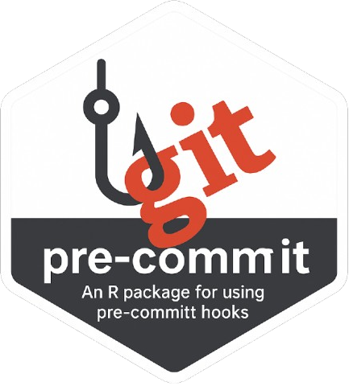

<!-- README.md is generated from README.Rmd. Please edit that file -->

# Rprecommit <a href=#></a>

<!-- badges: start -->

[](https://cran.r-project.org/package=Rprecommit)

[](https://github.com/alexym1/Rprecommit/actions/workflows/R-CMD-check.yaml)
[](https://app.codecov.io/gh/alexym1/Rprecommit?branch=master)
<!-- badges: end -->

> Running precommit in R

## Overview

`Rprecommit` is a package that allows you to run pre-commit checks in R.
This package is inspired by the package
[lorenzwalthert/precommit](https://github.com/lorenzwalthert/precommit).`Rprecommit`
is designed to run pre-commit **WITHOUT ANY PYTHON DEPENDENCIES**. The
package embeds numerous hooks based on the state-of-the-art R packages.

The package is still under development and new features will be added in
the future.

## Installation

The latest version can be installed from GitHub as follows:

``` r
install.packages("devtools")
devtools::install_github("alexym1/Rprecommit")
```

## Usage

### Initialize pre-commit framework

``` r
Rprecommit::install_precommit()
```

### Run hooks

``` r
Rprecommit::run_precommit()
```

### Add hooks

Editing the `.pre-commit-config` file using
`Rprecommit::edit_precommit_config()`:

``` bash
repos:
  - repo: local
    hooks:
      - id: renv
        name: Synchronize project from renv.lock
        description: Synchronize the project from the renv.lock
        entry: Rscript inst/pre-commit/hooks/synchronize_project.R
        language: system
        pass_filenames: false
```

## Code of conduct

Please note that this project is released with a [Contributor Code of
Conduct](https://alexym1.github.io/Rprecommit/CONTRIBUTING.html). By
participating in this project you agree to abide by its terms.
