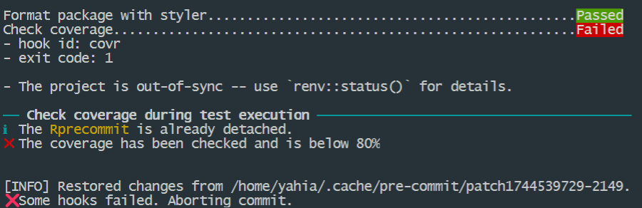

# Introduction to captain

Git hook scripts are useful for identifying simple issues before
submission to code review. We run our hooks on every commit to
automatically point out issues in code such as missing semicolons,
trailing whitespace, and debug statements. By pointing these issues out
before code review, this allows a code reviewer to focus on the
architecture of a change while not wasting time with trivial style
nitpicks. - [pre-commit](https://pre-commit.com/)

## How it works

``` r
captain::install_precommit()

#> Install `.git/hooks/pre-commit` file
#> Install `inst/pre-commit folder`
```

``` r
captain::run_precommit()
```


